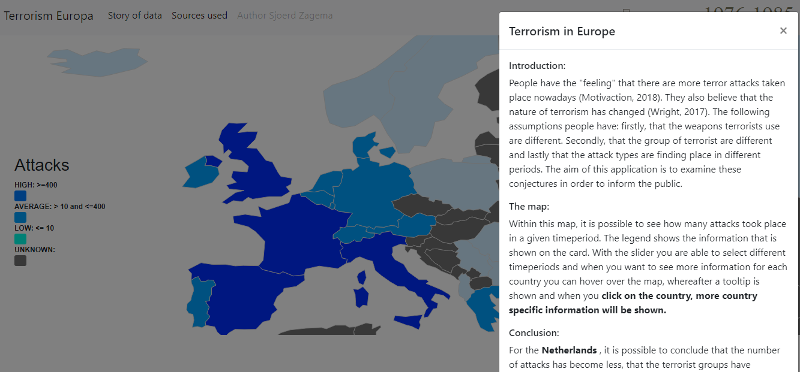

<h1>Terrorism in Europe (1990-2015)</h1>

Sjoerd Zagema  
12195677  
Programmeerproject  
Minor Programmeren UvA 2018   

[Final Application](https://sjoerdjevoet.github.io/Final_project/)

<h2>Introduction</h2>

People have the "feeling" that there are more terror attacks taken place nowadays (Motivaction, 2018). They also believe that the nature of terrorism has changed (Wright, 2017). The following assumptions people have: firstly, that the weapons terrorists use are different. Secondly, that the group of terrorist are different and lastly that the attack types are finding place in different periods. 

<blockquote>
    
The aim of this application is to examine these conjectures in order to inform the public
    
</blockquote>

<h2> Solution </h2>

<h4> The Application: </h4>

 There are four visualisations: a map, a donut chart, a heatmap and a bar chart. Within this map, it is possible to see how many attacks took place in a given timeperiod. The legend shows the information that is shown on the card. With the slider you are able to select different timeperiods and when you want to see more information for each country you can hover over the map, whereafter a tooltip is shown and when you click on the country, more country specific information will be shown. The attacktypes are presented in a donut chart . By hover you could see additional information. By clicking on the square in the legend it is possible to filter the attack types. Information about the terrorist groups in shown in a horizontal bar chart. This is sorted by the group of terrorist with the most attacks. The heatmap displays the five different targettypes with respect to a given month. The more attacks there have been, the darker the sqaure becomes. By hovering the square you see the exact amount of attacks.  

<h4> Conclusion </h4>

 For the Netherlands , it is possible to conclude that the number of attacks has become less, that the terrorist groups have changed over time and that the attack type largely shifted from Bombing to Infrastructure attacks 

