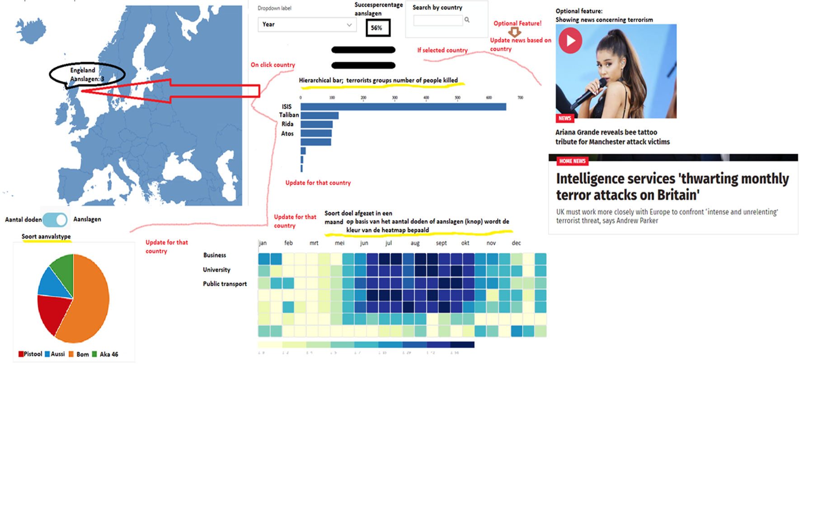

<h1>Terrorisme in Europa</h1>

<h2>Introductie</h2>

De afgelopen jaren is Europa geschrokken van aanslagen met een groot aantal doden in Parijs, Brussel, Londen en Madrid. Volgens de Nationale Coördinator Terrorismebestrijding en Veiligheid is “de kans op een aanslag in Nederland reëel.” Het gevoel leeft dat er steeds meer terrorisme is in Europa, maar klopt dat met de cijfers: is het aantal doden door terroristische aanslagen de afgelopen jaren toegenomen?

<h2> Probleemstelling </h2>

 Mensen hebben door de genoemde aanslagen een "onveiliger gevoel" gekregen. In hoeverre wordt dit gevoel bevestigt door de cijfers? Kent Europa meer terroristische aanslagen t.o.v. 1990 ? En hoe ziet de onderliggende data eruit: is een terroristiche aanslag altijd geslaagd? Op welke manier wordt het vaakst een terroristiche aanslag uitgevoerd? Door welke groepering? Het doel van dit project is om meer inzicht te krijgen in het succespercentage van een terroristische aanslag en de frequentie en het soort aanslagen met betrekking tot de verschillende Europese landen.

<h3> Doelgroep </h3>

 De bezorgde burger 

<blockquote>
    
Het idee in één zin

  Het idee is om de bezorgde burger te informeren met betrekking tot de terroristische aanslagen in Europa op basis van verschillende visualisaties
    
</blockquote>

<h2> Oplossing </h2>

